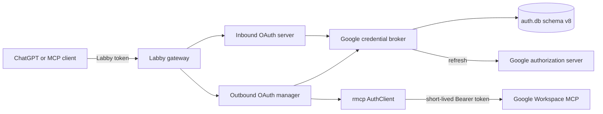
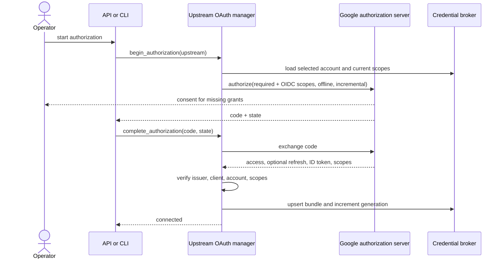
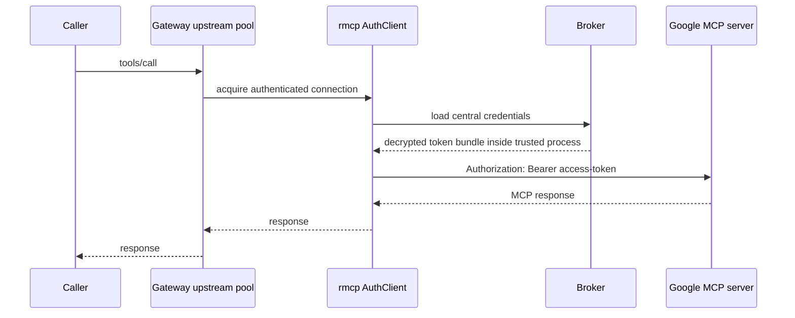
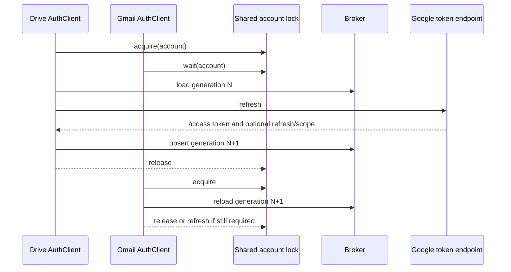
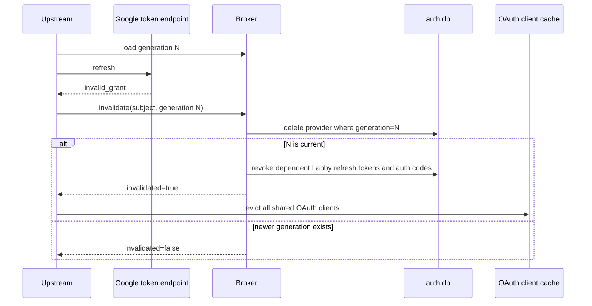
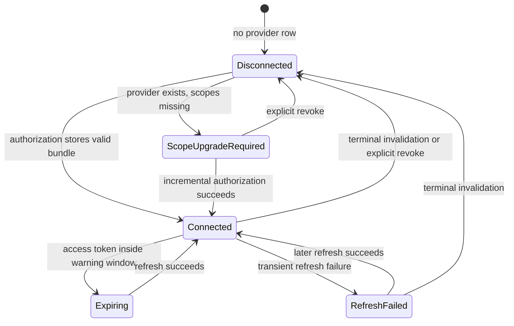

# Google Credential Broker

This document is the canonical specification, security contract, data model,
configuration contract, API contract, and implementation guide for Labby's
central Google credential broker.

The broker allows inbound Labby OAuth and Google-hosted Workspace MCP servers to
reuse one encrypted Google refresh credential per Google account without copying
that refresh credential into every upstream integration.

## Executive Summary

Before this design, Labby had two independent Google OAuth worlds:

1. inbound Google OAuth, used to authenticate clients such as ChatGPT to Labby;
2. outbound OAuth, used by Labby to connect to Google Drive, Gmail, Calendar,
   and People MCP servers.

Each outbound upstream persisted its own token bundle. With one Google account
and OAuth client, this produced duplicate long-lived credentials, independent
refresh races, and several revocation surfaces.

The broker changes the ownership model:

- one encrypted provider credential is stored per Google `sub`;
- Google `sub` is the canonical account key;
- a verified email may select an account but never replaces `sub` as identity;
- every Google MCP upstream declares its required scopes;
- an rmcp `CredentialStore` adapter loads and refreshes the central credential;
- the long-lived refresh token remains inside `labby-auth`;
- only a short-lived bearer access token reaches the MCP HTTP transport;
- incremental authorization upgrades the same credential for new scopes;
- terminal refresh failure invalidates an exact generation and revokes dependent
  inbound Labby grants;
- per-upstream disconnect cannot delete shared state;
- explicit shared revocation requires administrative scope and confirmation.

The default remains `dedicated`, so existing non-Google OAuth integrations stay
backward compatible.

## Status And Source Ownership

The implementation spans:

- `crates/labby-runtime/src/gateway_config.rs`
- `crates/labby-auth/src/google.rs`
- `crates/labby-auth/src/types.rs`
- `crates/labby-auth/src/sqlite.rs`
- `crates/labby-auth/src/sqlite/migrations.rs`
- `crates/labby-auth/src/sqlite/google_credentials.rs`
- `crates/labby-auth/src/upstream/google_store.rs`
- `crates/labby-auth/src/upstream/manager.rs`
- `crates/labby-auth/src/upstream/types.rs`
- `crates/labby-gateway/src/gateway/oauth.rs`
- `crates/labby-gateway/src/gateway/oauth_lifecycle.rs`
- `crates/labby-gateway/src/gateway/catalog.rs`
- `crates/labby-gateway/src/gateway/dispatch.rs`
- `crates/labby/src/api/upstream_oauth.rs`
- `crates/labby/src/cli/gateway/args.rs`
- `crates/labby/src/cli/gateway/dispatch.rs`

The auth database schema version is 8.

Normative terms **MUST**, **MUST NOT**, **SHOULD**, **SHOULD NOT**, and **MAY**
are used deliberately.

## Goals

The broker MUST:

1. keep one durable Google refresh credential per Google account;
2. reuse it across inbound Labby OAuth and compatible Google MCP upstreams;
3. bind credentials to a stable Google `sub`;
4. require the same OAuth client ID that owns the refresh token;
5. require Google's issuer for shared-provider upstreams;
6. verify required scopes before treating an upstream as connected;
7. support incremental scope upgrades;
8. encrypt access and refresh tokens at rest;
9. avoid refresh-token copies in upstream rows, config, environments, APIs,
   CLI output, and logs;
10. serialize refreshes targeting the same shared credential;
11. invalidate rejected credentials generation-safely;
12. preserve dedicated OAuth as the default;
13. expose redacted status for scope, client, and account diagnosis;
14. require an explicit destructive operation for shared revocation.

## Non-Goals

The broker does not:

- make one token valid for a different OAuth client ID;
- bypass consent, administrator policy, or API authorization;
- expose provider refresh tokens to MCP servers;
- merge unrelated Google accounts;
- implement service accounts or domain-wide delegation;
- convert Google tokens into generic non-Google credentials;
- guarantee arbitrary third-party stdio servers can consume brokered tokens;
- eliminate verification requirements for restricted scopes;
- automatically import opaque historical upstream token blobs.

## Terminology

- **Provider credential:** central encrypted Google token bundle keyed by `sub`.
- **Dedicated credential:** token bundle owned by one
  `(upstream_name, subject)` pair.
- **Shared Google upstream:** an upstream using
  `credential.source=google_provider`.
- **Account selector:** optional Google `sub` or verified email.
- **Required scopes:** upstream scopes plus `openid email profile` in shared mode.
- **Granted scopes:** normalized scopes associated with the provider credential.
- **Generation:** monotonically increasing compare-and-delete version.

## Primary Google References

The implementation follows these primary sources:

- Workspace MCP servers and scopes:
  https://developers.google.com/workspace/mcp/configure-mcp
- OAuth web-server flow and incremental authorization:
  https://developers.google.com/identity/protocols/oauth2/web-server
- OpenID Connect and stable `sub`:
  https://developers.google.com/identity/openid-connect/openid-connect
- OAuth refresh-token lifecycle:
  https://developers.google.com/identity/protocols/oauth2
- Gmail scopes:
  https://developers.google.com/workspace/gmail/api/auth/scopes
- Workspace API user-data policy:
  https://developers.google.com/workspace/workspace-api-user-data-developer-policy
- Workspace MCP security guidance:
  https://developers.google.com/workspace/mcp/security

Key constraints:

- offline access is required for a refresh token;
- incremental authorization uses `include_granted_scopes=true`;
- later authorization responses may omit a refresh token;
- refresh responses may omit `scope` and `id_token`;
- `sub` is durable identity while email is not;
- refresh tokens are bound to their OAuth client;
- tokens may be revoked through user action, inactivity, policy, account changes,
  or token limits;
- broad Drive and several Gmail scopes are sensitive or restricted;
- Workspace MCP servers are a Developer Preview surface.

## Supported Google Workspace MCP Profiles

| Service | MCP endpoint | Application scopes |
| --- | --- | --- |
| Drive | `https://drivemcp.googleapis.com/mcp/v1` | `drive.readonly`, `drive.file` |
| Gmail | `https://gmailmcp.googleapis.com/mcp/v1` | `gmail.readonly`, `gmail.compose` |
| Calendar | `https://calendarmcp.googleapis.com/mcp/v1` | `calendar.calendarlist.readonly`, `calendar.events.freebusy`, `calendar.events.readonly` |
| People | `https://people.googleapis.com/mcp/v1` | `directory.readonly`, `userinfo.profile`, `contacts.readonly` |

The table abbreviates `https://www.googleapis.com/auth/` where applicable.
Labby adds `openid`, `email`, and `profile` in shared mode so an upgraded
bundle can be rebound to the same Google `sub`.

## Architecture



### Layer ownership

- `labby-runtime` owns serialized configuration.
- `labby-auth` owns verification, persistence, encryption, selection, scope and
  client validation, refresh, invalidation, and the rmcp adapter.
- `labby-gateway` owns lifecycle, safe status projection, cache eviction, and
  dispatch actions.
- the `labby` binary owns HTTP routes, CLI commands, confirmation, and UI-facing
  presentation.

## Security Model

### Protected assets

- Google access and refresh tokens;
- authorization codes and PKCE verifiers;
- ID tokens;
- account identifiers and verified email;
- OAuth client secrets;
- Workspace content returned through MCP tools.

### Mandatory controls

- Access and refresh tokens MUST be encrypted at rest when a key is configured.
- Provider tokens MUST NOT be serialized into product output.
- Provider tokens MUST NOT appear in `Debug` output.
- Full `sub`, email, account selector, token, code, verifier, ID token, client
  secret, or secret environment value MUST NOT be logged.
- Logs MAY include a one-way subject fingerprint.
- Issuer MUST equal `https://accounts.google.com`.
- Client ID MUST match the client that owns the central token.
- Shared mode MUST use preregistered client metadata.
- Missing scopes and ambiguous accounts MUST fail closed.
- A callback returning a different `sub` MUST fail closed.
- Per-upstream clear MUST NOT remove shared state.
- Shared revocation MUST require `lab:admin` and `confirm=true`.

Workspace content remains untrusted. Email bodies, document text, events, contact
fields, and file metadata may contain prompt injection. Credential sharing does
not weaken existing action confirmation or authorization requirements.

## Identity Contract

`subject` stores the verified Google ID-token `sub` and is the primary key.
Email is normalized to lowercase, optional, and only an operator-friendly
selector.

Selection with `credential.account`:

1. trim the selector;
2. prefer exact `subject`;
3. otherwise match `email COLLATE NOCASE`;
4. fail if no credential matches.

Without a selector:

- zero rows means disconnected;
- one row is selected;
- multiple rows return `oauth_account_ambiguous`.

A callback MUST verify the ID token and reject invalid claims,
`email_verified=false`, an unexpected `sub`, or a selector mismatch.

## Client And Issuer Contract

A shared Google credential requires:

- `registration.strategy=preregistered`;
- non-empty `client_id`;
- the same client ID stored on the provider row;
- a resolvable client secret when configured;
- authorization metadata issuer `https://accounts.google.com`.

Dynamic registration and Client ID Metadata Documents are not valid shared
sources. A legacy row with empty `client_id` must be rebound through one
Google authorization before shared use.

## Scope Contract

Scopes are trimmed, empty entries removed, sorted, and deduplicated. Google's
`userinfo.email` and `userinfo.profile` URI forms are canonicalized to the OIDC
`email` and `profile` aliases so token responses cannot trigger false missing-scope
results.

For dedicated credentials:

```text
effective scopes = configured scopes
```

For shared Google credentials:

```text
effective scopes = configured scopes UNION {openid, email, profile}
```

An upstream is usable only when:

```text
required_scopes is a subset of granted_scopes
```

Missing scopes produce `oauth_scope_upgrade_required`, HTTP 403, lifecycle state
`scope_upgrade_required`, and `authenticated=false`.


## Authorization And Token Flows

### Browser-session login

Browser-session login requests verified OIDC identity only. It MUST NOT request
`access_type=offline`, `include_granted_scopes`, or forced consent because the
session flow discards provider tokens and must not mint an unused refresh token
that competes with the broker credential.

### Incremental scope upgrade

The normal upstream authorization action is also the scope-upgrade action.
Google combines newly requested scopes with prior grants because Labby sends
`include_granted_scopes=true` and requests offline access.



If Google omits a refresh token, Labby preserves the existing refresh token. If
no existing refresh token exists, the flow fails rather than storing an
access-token-only credential. If a refresh response omits scopes, Labby preserves
the previously granted scopes.

### Normal Google MCP request



The refresh token is never sent to the MCP server.

### Shared refresh



### Terminal refresh failure



Network errors, timeouts, rate limits, and transient server errors MUST NOT
delete the provider credential.

## State Machine



Product state values are snake_case. Client mismatch and account ambiguity are
error outcomes rather than persisted states.

## Configuration Contract

Omitting the credential block is equivalent to:

```toml
[upstream.oauth.credential]
source = "dedicated"
```

Shared Google example:

```toml
[[upstream]]
name = "google-calendar"
url = "https://calendarmcp.googleapis.com/mcp/v1"

[upstream.oauth]
mode = "authorization_code_pkce"
scopes = [
  "https://www.googleapis.com/auth/calendar.calendarlist.readonly",
  "https://www.googleapis.com/auth/calendar.events.freebusy",
  "https://www.googleapis.com/auth/calendar.events.readonly",
]

[upstream.oauth.credential]
source = "google_provider"
account = "admin@example.com"

[upstream.oauth.registration]
strategy = "preregistered"
client_id = "configured-google-client-id"
client_secret_env = "LABBY_GOOGLE_CLIENT_SECRET"
```

`account` MAY be omitted when exactly one central credential exists. It SHOULD
be explicit in multi-account or future multi-account deployments.

### Credential-source JSON Schema

```json
{
  "$id": "https://dinglebear.ai/schemas/upstream-oauth-credential-source.json",
  "$schema": "https://json-schema.org/draft/2020-12/schema",
  "oneOf": [
    {
      "type": "object",
      "additionalProperties": false,
      "required": ["source"],
      "properties": { "source": { "const": "dedicated" } }
    },
    {
      "type": "object",
      "additionalProperties": false,
      "required": ["source"],
      "properties": {
        "source": { "const": "google_provider" },
        "account": {
          "type": ["string", "null"],
          "minLength": 1,
          "description": "Google sub or verified email"
        }
      }
    }
  ]
}
```

Shared mode validation requires HTTPS transport, authorization-code PKCE,
preregistered client metadata, a non-empty client ID, `client_secret_env`, at
least one configured Google Workspace application scope, Google issuer metadata,
`{PREFIX}_TOKEN_ENCRYPTION_KEY`, and no conflicting bearer-token configuration.
Opening a schema v7 database with that key idempotently encrypts legacy plaintext
provider access and refresh tokens before the broker can serve them.

Product OAuth has the same fail-closed requirement even when no shared
`google_provider` upstream is configured: `{PREFIX}_TOKEN_ENCRYPTION_KEY` must
be present and valid before the authorization runtime starts. The broker's
write methods independently reject missing encryption, so alternate callers
cannot persist plaintext. Bearer-only mode does not require this key. `labby
doctor` reports the key's presence and validity without logging its value.

## Database Contract

Schema version:

```text
PRAGMA user_version = 8
```

Provider table:

```sql
CREATE TABLE IF NOT EXISTS google_provider_credentials (
    subject TEXT PRIMARY KEY,
    email TEXT,
    client_id TEXT NOT NULL DEFAULT '',
    granted_scopes_json TEXT NOT NULL
        DEFAULT '["email","openid","profile"]',
    access_token TEXT,
    refresh_token TEXT NOT NULL,
    token_received_at INTEGER,
    access_token_expires_at INTEGER,
    issuer TEXT,
    last_refresh_at INTEGER,
    last_scope_upgrade_at INTEGER,
    generation INTEGER NOT NULL,
    created_at INTEGER NOT NULL,
    updated_at INTEGER NOT NULL
);

CREATE INDEX IF NOT EXISTS idx_google_provider_credentials_email
    ON google_provider_credentials(email COLLATE NOCASE);
```

| Column | Contract |
| --- | --- |
| `subject` | Canonical Google `sub`; primary key. |
| `email` | Optional normalized verified email. |
| `client_id` | OAuth client owning the refresh token. |
| `granted_scopes_json` | Sorted, deduplicated JSON string array. |
| `access_token` | Encrypted short-lived access token; nullable for legacy rows. |
| `refresh_token` | Encrypted durable provider token. |
| `token_received_at` | Unix seconds when the access token was received. |
| `access_token_expires_at` | Unix seconds when the access token expires. |
| `issuer` | Expected Google issuer. |
| `last_refresh_at` | Most recent successful refresh time. |
| `last_scope_upgrade_at` | Most recent grant enlargement time. |
| `generation` | Monotonic compare-and-delete version. |
| `created_at` | Original creation time. |
| `updated_at` | Last bundle replacement time. |

The v7-to-v8 migration is additive and idempotent. Existing refresh tokens are
preserved. Legacy rows receive empty client binding, baseline OIDC scopes, and
null access-token metadata. They continue to serve inbound OAuth but require one
authorization before shared upstream use.

Historical `upstream_oauth_credentials` blobs are not imported automatically.
They may belong to a different account or client and remain active only while an
upstream stays in dedicated mode.

## Rust Types And Models

```rust
#[serde(tag = "source", rename_all = "snake_case")]
pub enum UpstreamOauthCredentialSource {
    Dedicated,
    GoogleProvider { account: Option<String> },
}
```

```rust
pub struct GoogleProviderCredentialRow {
    pub subject: String,
    pub email: Option<String>,
    pub client_id: String,
    pub granted_scopes: Vec<String>,
    pub access_token: Option<String>,
    pub refresh_token: String,
    pub token_received_at: Option<i64>,
    pub access_token_expires_at: Option<i64>,
    pub issuer: Option<String>,
    pub last_refresh_at: Option<i64>,
    pub last_scope_upgrade_at: Option<i64>,
    pub generation: i64,
    pub created_at: i64,
    pub updated_at: i64,
}
```

```rust
pub struct GoogleProviderCredentialUpdate {
    pub subject: String,
    pub email: Option<String>,
    pub client_id: String,
    pub granted_scopes: Vec<String>,
    pub access_token: String,
    pub refresh_token: String,
    pub token_received_at: i64,
    pub access_token_expires_at: i64,
    pub issuer: Option<String>,
    pub refreshed: bool,
    pub scope_upgraded: bool,
}
```

```rust
pub struct GoogleCredentialBrokerStatus {
    pub account_selector_configured: bool,
    pub provider_generation: Option<i64>,
    pub client_bound: bool,
    pub required_scopes: Vec<String>,
    pub granted_scopes: Vec<String>,
    pub missing_scopes: Vec<String>,
}
```

No public model contains tokens, codes, client secrets, raw `sub`, or raw selected
email. Manual `Debug` implementations redact secret and identity material.


## rmcp Credential Store Contract

`GoogleProviderCredentialStore` implements rmcp's `CredentialStore`.

### Load

`load` MUST resolve exactly one account, validate client ID and required scopes,
decrypt the bundle, preserve granted scopes and issuer, and synthesize rmcp
`StoredCredentials`. A migrated row without an access token is represented as
expired so rmcp refreshes before use.

### Save

`save` MUST reject a different client ID, verify an ID token when present,
preserve existing identity when refresh omits an ID token, reject a changed
account, preserve the old refresh token when Google omits one, normalize scopes,
calculate expiry, encrypt and upsert the central bundle, and increment generation.

### Clear

rmcp may request local credential clearing during recovery. Shared-store `clear`
is intentionally non-destructive. Explicit broker revocation is the only shared
deletion path.

## Surface Contracts

All product routes and actions require authenticated administrative scope.

### Start or upgrade authorization

```http
POST /v1/gateway/oauth/start
Content-Type: application/json

{ "upstream": "google-calendar" }
```

The returned authorization URL requests the selected upstream's effective scopes.
For shared mode, completing this flow creates or upgrades the central row.

### Status

```http
GET /v1/gateway/oauth/status?upstream=google-calendar
```

Representative scope-upgrade response:

```json
{
  "authenticated": false,
  "upstream": "google-calendar",
  "credential_source": "google_provider",
  "google_credential_broker": {
    "account_selector_configured": true,
    "provider_generation": 4,
    "client_bound": true,
    "required_scopes": [
      "email",
      "https://www.googleapis.com/auth/calendar.events.readonly",
      "openid",
      "profile"
    ],
    "granted_scopes": ["email", "openid", "profile"],
    "missing_scopes": [
      "https://www.googleapis.com/auth/calendar.events.readonly"
    ]
  },
  "state": "scope_upgrade_required",
  "expires_within_5m": false,
  "refresh_attempted": false,
  "refreshed": false,
  "refresh_error_kind": "oauth_scope_upgrade_required",
  "refresh_error": "the shared Google credential lacks one or more scopes required by this MCP server"
}
```

### Dedicated clear

```http
POST /v1/gateway/oauth/clear?upstream=example
```

A shared Google source returns `oauth_shared_credential_protected`.

### Explicit shared revoke

```http
POST /v1/gateway/oauth/google/revoke
Content-Type: application/json

{
  "upstream": "google-calendar",
  "confirm": true
}
```

Response contains counts only:

```json
{
  "invalidated": true,
  "revoked_refresh_tokens": 2,
  "revoked_authorization_codes": 0
}
```

### Gateway actions

- `gateway.oauth.start`: initial or incremental authorization.
- `gateway.oauth.status`: safe broker and lifecycle status.
- `gateway.oauth.clear`: dedicated credentials only.
- `gateway.oauth.google_revoke`: destructive shared revoke, admin-only, requires
  `confirm=true`, returns `GoogleProviderInvalidation`.

### CLI

```console
labby gateway mcp auth start google-calendar --open --wait
labby gateway mcp auth status google-calendar --json
labby gateway mcp auth clear dedicated-upstream
labby gateway mcp auth revoke-google google-calendar --confirm
```

Without `--confirm`, shared revoke returns `confirmation_required`.

### Web UI

The upstream OAuth card MUST understand `scope_upgrade_required` and SHOULD:

- display `Shared Google` for `credential_source=google_provider`;
- list missing scopes in a collapsed detail view;
- label authorization `Grant scopes` when scopes are missing;
- hide ordinary Disconnect for shared credentials;
- provide separately confirmed `Revoke shared Google access`;
- warn that revocation affects all Google MCP services and dependent inbound
  Labby sessions;
- never display account identity or token material.

## Error Contract

| Kind | HTTP | Meaning | Remediation |
| --- | ---: | --- | --- |
| `oauth_scope_upgrade_required` | 403 | Required scopes are missing. | Authorize the upstream and grant missing scopes. |
| `oauth_account_ambiguous` | 409 | Multiple accounts exist without a selector. | Configure `credential.account`. |
| `oauth_client_mismatch` | 409 | Configured client does not own the token. | Use the original client or reauthorize. |
| `oauth_shared_credential_protected` | 409 | Ordinary clear targeted shared state. | Use explicit shared revoke. |
| `oauth_issuer_mismatch` | 502 | Metadata issuer is not Google. | Correct endpoint or metadata. |
| `oauth_needs_reauth` | 401 | Credential is absent or terminally invalid. | Reauthorize Google. |
| `confirmation_required` | 422 | Shared revoke was not confirmed. | Retry with confirmation. |

Error text MUST be safe for HTTP, MCP, CLI, and logs.

## Observability Contract

Broker events SHOULD contain:

- `service=upstream_oauth`;
- `action`;
- `upstream`;
- `credential_source`;
- `provider_generation` when known;
- fingerprinted `subject_id`;
- required, granted, and missing scope counts;
- refresh attempted/result;
- invalidation and dependent-revocation counts;
- stable `kind` on failure;
- `elapsed_ms`.

Never log access tokens, refresh tokens, codes, PKCE verifiers, ID tokens, client
secrets, raw subjects, raw emails, account selectors, or authorization URLs that
contain state/code parameters. Scopes MAY be logged when needed, but counts are
preferred for routine events.

## Concurrency And Generation Contract

Within one process, inbound Labby refresh, outbound Google MCP refresh, status
probes, and explicit revocation use one process-global lock keyed by the resolved
stable Google `sub`. Different email/subject selectors for the same account
therefore converge on the same lock once the provider row exists.

Across processes, generation checks prevent an old failure from deleting a newer
bundle. They do not provide a complete distributed refresh lease. Deployments
sharing one auth database SHOULD run one active OAuth writer.

Generation rules:

- initial insertion uses generation 1;
- every successful authorization or refresh increments generation;
- terminal failure deletes only the exact generation it observed;
- stale invalidation returns `invalidated=false`;
- dependent grants are revoked only when the provider row was deleted.

## Explicit Revocation Contract

Explicit revoke:

1. resolves the configured account;
2. captures its current generation;
3. compare-and-deletes the provider row;
4. deletes dependent inbound Labby refresh tokens for the same subject;
5. deletes pending inbound authorization codes for the same subject;
6. returns redacted counts;
7. evicts all cached OAuth clients;
8. leaves dormant dedicated upstream rows untouched.

Deleting Labby's local row does not call Google's remote revocation endpoint. A
future remote-revoke feature must be separate and explicitly confirmed.

## Failure Modes

- **Authorization omits refresh token:** preserve existing refresh token; fail if
  none exists.
- **Refresh omits scopes:** preserve prior granted scopes.
- **Refresh omits ID token:** preserve verified existing identity.
- **Migrated row lacks access token:** treat as expired and refresh.
- **Client mismatch:** do not send a token request.
- **Issuer mismatch:** do not send credentials.
- **Missing scopes:** do not contact the MCP server.
- **Multiple accounts:** do not guess.
- **Transient endpoint failure:** preserve credentials and use refresh backoff.
- **Terminal invalid_grant:** generation-safe invalidation and dependent grant
  revocation.
- **rmcp local clear:** no-op for shared state.
- **Endpoint or metadata changes:** fail discovery or issuer validation.

## Rollout Plan

### Phase 1: schema and code

1. deploy schema v8;
2. leave all upstreams dedicated;
3. verify inbound OAuth refresh;
4. verify provider metadata is populated after authorization or refresh.

### Phase 2: canary

1. back up `auth.db` and configuration;
2. select one explicit Google account;
3. configure Calendar with `source=google_provider`;
4. inspect status;
5. run incremental authorization when scopes are missing;
6. verify no shared token is written to an upstream row;
7. exercise read-only tools;
8. observe one automatic refresh.

### Phase 3: remaining services

Configure Drive, Gmail, and People with the same client and account selector.
Authorize only missing scopes, verify each required subset, and confirm one
provider row remains.

### Phase 4: retention cleanup

After a retention window, dormant dedicated Google rows MAY be deleted by a
separate maintenance operation. Cutover does not delete them automatically.

## Rollback Plan

1. remove the credential block or set `source=dedicated`;
2. reload the gateway;
3. historical dedicated rows become active if still valid;
4. reauthorize dedicated upstreams when needed;
5. leave schema v8 in place because it is additive;
6. restore a pre-cutover database only for full credential-state rollback.

## Testing Contract

### Unit tests

- default and Google credential-source serde;
- scope normalization and subset calculation;
- account lookup by subject and email;
- ambiguity, client, issuer, and scope rejection;
- token-bundle round trip and at-rest encryption;
- generation advancement;
- v7-to-v8 migration;
- ID-token account mismatch;
- omitted refresh token and omitted scope preservation;
- shared adapter clear protection;
- unchanged dedicated behavior.

### Integration tests

- inbound authorization creates one provider row;
- Workspace authorization upgrades the same row;
- multiple Google upstreams consume the same row;
- no per-upstream shared token blob is written;
- parallel refreshes rotate one central generation;
- terminal and stale invalidation behave safely;
- dependent inbound grants are revoked;
- status exposes scope upgrade safely;
- ordinary clear is rejected;
- shared revoke requires confirmation and returns counts.

### Surface tests

- CLI JSON preserves the status schema;
- HTTP mapping follows the stable error contract;
- catalog marks shared revoke destructive;
- dispatch requires admin and confirmation;
- UI renders shared and scope-upgrade states;
- UI never serializes identity or token fields.

### Live verification

A production verification MUST confirm:

1. one provider row for the selected account;
2. no provider-token copies in Labby local refresh rows;
3. status reports `credential_source=google_provider`;
4. missing-scope lists are empty;
5. a tool call succeeds for each Google MCP server;
6. one automatic access-token rollover succeeds;
7. logs contain no raw credentials;
8. ordinary clear is rejected;
9. explicit revoke is not run during routine validation.

## Compatibility

No configuration change means dedicated mode. Inbound callers continue receiving
Labby JWTs and Labby refresh tokens, never Google tokens. Status fields are
additive, but strict clients must accept the new `scope_upgrade_required` enum
value. Schema v8 is additive and does not require downgrade during rollback.

## Axon And Cortex Propagation

Labby is the source of truth. Any vendored OAuth implementation in Axon or Cortex
MUST receive schema v8, central types, Google scope/identity handling, adapter,
new stable errors, generation-safe invalidation, tests, and documentation. Prefer
a shared auth crate over repeated copies.

## Operational Checklist

For OAuth clients with publishing status **Testing**, authorizations that include
Workspace API scopes expire after seven days, including offline refresh tokens.
The OIDC-only exception no longer applies once Calendar, Drive, Gmail, or People
scopes are requested. A durable deployment MUST use an appropriate Internal or In
Production OAuth audience and complete any required sensitive/restricted-scope
verification. See Google's current app-audience guidance:
https://support.google.com/cloud/answer/15549945

Before enabling:

- [ ] OAuth client matches inbound Labby Google OAuth.
- [ ] Client secret environment variable is present.
- [ ] Redirect URI is registered.
- [ ] Required APIs and MCP access are enabled.
- [ ] Restricted-scope implications are understood.
- [ ] One selector is used consistently.
- [ ] Database and configuration backups exist.
- [ ] Token encryption key is configured and recoverable.
- [ ] The first canary uses read-only tools.

After enabling:

- [ ] Status reports shared Google source.
- [ ] Client binding is true.
- [ ] Missing scopes are empty.
- [ ] Provider row count is unchanged.
- [ ] No shared refresh token appears in upstream rows or environment.
- [ ] Tool discovery and one rollover succeed.
- [ ] Logs remain redacted.

## Acceptance Criteria

The feature is complete when one encrypted provider row authorizes configured
Google Workspace MCP servers; no refresh token is copied into upstream state;
issuer, client, account, and scopes are validated; incremental authorization
upgrades the same row; refresh works through rmcp; terminal invalidation is
generation-safe; dedicated OAuth remains the default; all surfaces and migrations
are tested; and documentation, errors, observability, examples, and rollout steps
match the implementation.
